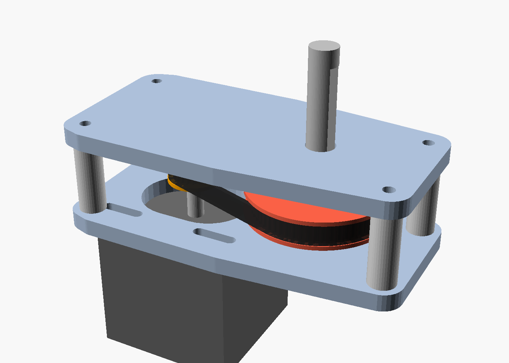

# NEMA17 (SF2424) GT2 Robot Joint Actuator — 3:1

GT2 타이밍 벨트 감속(20T → **60T = 3:1**) 로봇 조인트 액추에이터.
구조 파트(풀리·샤프트·플레이트)는 **3D 프린팅**, **608ZZ 베어링**과 **GT2 벨트는 구매 부품**으로 처음부터 적용하는 파라메트릭 OpenSCAD 설계입니다.



---

## 입력 규격 해석

| 코드 | 해석 |
|------|------|
| `TP-5-6M-20T-16H` (입력 풀리) | Timing Pulley / 보어 **5mm**(NEMA17 샤프트) / 벨트폭 **6mm** / **20T** / 플랜지 OD **16mm** |
| `60T 5MM 8MM` (출력 풀리) | **60T** / 6mm 계열 / 보어 **8mm** |

> **"6M" 해석 (확정):** `6M`을 HTD-6M(6mm 피치)이 아니라 **6mm 벨트폭**으로 해석했고,
> 이 해석이 맞는 것으로 확정되었습니다. **GT2(2mm 피치)** 로 설계했으며, 위 모든 치수(5mm/8mm 보어, 16mm 플랜지)가 GT2 6mm 기준과 일관됩니다.

---

## Repository layout

```text
cad/                 OpenSCAD mechanical design
  lib/               params.scad + reusable modules
  src/               one printable part per file, plus preview-only assembly.scad
  render.ps1         export printable parts to cad/build/*.stl
docs/                reference notes
preview.png          assembly render preview
```

모든 공유 치수와 공차는 **`cad/lib/params.scad`** 에서 관리합니다.
파트별 STL은 `cad/src/*.scad`가 각각 자기 자신을 렌더링하도록 구성되어 있습니다.

---

## 파트 목록

| 파일 | 설명 | 수량 |
|--------|------|------|
| `cad/src/input_pulley.scad`   | 20T GT2 풀리 (보어 5mm, 플랜지 양면, M3 셋스크류) | 1 |
| `cad/src/output_pulley.scad`  | 60T GT2 풀리 (보어 8mm, 플랜지 양면, M3 셋스크류) | 1 |
| `cad/src/motor_plate.scad`    | **모터 패드 + 베어링 허브 트러스 + 4개 코너 타워 일체형**. 모터 구멍은 장력조절용 슬롯 | 1 |
| `cad/src/support_plate.scad`  | 베어링 허브와 4개 체결부를 연결하는 상부 지지 플레이트 | 1 |
| `cad/src/output_shaft.scad`   | 프린트 출력샤프트 8mm (셋스크류용 D컷, 샤프트 숄더 일체) | 1 |
| `cad/src/output_arm.scad`     | 출력 링크/암 (선택) | 1 |
| `cad/src/assembly.scad`       | 전체 조립 시각화 (출력 비대상) | — |

---

## 베어링

출력 구멍에는 **608ZZ 베어링(22 OD × 7 W × 8 ID) 압입 보어**를 사용합니다.
프린트 풀리 + 프린트 8mm 샤프트로 시작하고, 이후 8mm 연삭 샤프트로 교체할 수 있습니다. 프레임/볼트 패턴은 동일합니다.

> **벨트는 구매 부품입니다.** 실물 GT2 6mm 닫힌루프 벨트를 사용하세요(프린팅하지 않음).

### 베어링·샤프트 이탈 방지

`plate_th = bearing_w`로 맞춰 플레이트 자체가 베어링 전체 폭을 지지합니다. 별도의 국소 허브 돌출 없이 압입 보어가 플레이트 전체 두께를 관통합니다.

**베어링 고정: 압입 보어만 사용**

- **압입:** 608ZZ 외륜을 포켓에 압입(`bearing_press_fit = 0.10mm` 간섭) — 라디얼 고정 + 마찰로 축방향도 잡힘
- **포켓:** 외측 립/막힌 캡/내륜 도피 홈 없음. 양 플레이트 모두 Ø`bearing_od - bearing_press_fit` 보어가 베어링 폭만큼 뚫립니다.
- 양 플레이트 외륜은 모두 고정해도 되지만, 내륜은 샤프트 숄더가 한쪽만 잡아 **과구속(바인딩) 없음**

**샤프트 축방향 잠금:**

- `output_shaft` 일체형 **안쪽 숄더** (`shaft_shoulder_d ≈ 12mm`, `shaft_shoulder_h ≈ 3mm`) — 상부 베어링 **갭쪽(안쪽) 내륜 면**에 착좌해 **빠짐(pull-out) 기계적 정지**. 모터 쪽으로 밀림은 출력 풀리 D컷 셋스크류가 잡음. (출력 풀리는 **허브가 아래**로 가게 조립해 이 숄더를 피함)

| 파라미터 | 값 | 설명 |
| -------- | --- | ---- |
| `bearing_press_fit` | 0.10 mm | 외륜 압입 간섭(직경) |
| `bearing_od` | 22.0 mm | 608ZZ 외륜 직경 |
| `bearing_w` | 7.0 mm | 608ZZ 폭 및 포켓 깊이 |
| `shaft_shoulder_d` | ~12 mm | 샤프트 숄더 직경 |
| `shaft_shoulder_h` | ~3 mm | 샤프트 숄더 높이 |

---

## 핵심 치수 / 기본값

- 감속비 3:1, 중심거리 `center_distance = 32.5 mm`
- 풀리 PD: 20T ≈ 12.73mm (OD 12.2), 60T ≈ 38.20mm (OD 38.2)
- 벨트: **GT2 6mm 닫힌루프 75T(150mm)**, 플레이트 간격 `plate_gap = 25mm`
- 베어링: 608ZZ ×2 / 출력 보어 8mm / 입력 보어 5mm
- 셋스크류: M3 / **리드↔포스트 결합: M3 자가탭(또는 heat-set 인서트)**
- **스탠드오프 = 모터 플레이트 일체형 코너 타워**: 높이 `plate_gap`, 포스트 상단 `post_pilot_d = 2.6mm` 자가탭 파일럿
- **프레임**: 두 플레이트는 노드(베어링 허브·포스트 보스·모터 패드) + 스트럿 구조입니다. 두 플레이트 형상은 **서로 다르며**, 베이스는 모터 패드와 코너 타워가 한 덩어리처럼 이어집니다. 튜닝: `strut_w = 8`, `hub_collar = 6`, `boss_extra = 3`, `motor_pad_margin = 3`

### 공차 / 끼워맞춤 (0.28mm Standard @ SparkX i7, 0.4 노즐 기준)

빡빡한 출력 프로파일에 맞춰 조이는 값으로 파라미터화:

- `boolean_eps = 0.02` — CSG 겹침 전용(작게 유지, 동일평면 면 방지)
- `bore_clearance = 0.20` — 프린트 보어↔샤프트/스크류 슬립핏(직경)
- `tooth_clearance = 0.06` — GT2 톱니 골 확장(벨트 맞물림)
- `bearing_press_fit = 0.10` — 608ZZ 포켓 압입(양수값은 포켓 직경을 줄임)
- `print_chamfer = 0.6` — 베어링 포켓·풀리 보어·샤프트 끝·암 보어에 45° 리드인(압입/슬립핏 시작 용이 + 첫 레이어 엘리펀트풋 완화)
> 실측 후 너무 빡빡하면 위 값을 0.05~0.1mm씩 키우세요.

### 벨트 길이 / 장력
모터 플레이트의 4개 장착 구멍과 보스 구멍이 **X축 슬롯(`tension_travel = 6mm`)** 이라 모터를 밀고당겨 장력을 잡습니다.

닫힌 루프 벨트 길이:  `L = 2C + π·(PD₁+PD₂)/2 + (PD₂−PD₁)²/(4C)`
- C=32.5 → L ≈ 150mm → **GT2 6mm 닫힌루프 75T(150mm)** 사용 후 슬롯으로 텐션.
- 다른 벨트를 쓰려면 위 식으로 C를 역산해 `center_distance`만 바꾸면 됩니다.

---

## BOM

**프린트**
- input_pulley ×1, output_pulley ×1, **motor_plate ×1 (포스트 일체형)**, support_plate ×1
- output_shaft ×1 (숄더 일체), (선택) output_arm ×1

**하드웨어 (구매, 필수)**

- **608ZZ 베어링 ×2** (22 OD × 8 ID × 7 W)  ← 처음부터 적용 (압입 보어만 사용)
- **GT2 6mm 닫힌루프 벨트 75T(150mm) ×1**  ← 직접 구매
- M3 grub(셋스크류) ×2 (풀리 ×2), 가능하면 황동 heat-set 인서트
- **리드↔포스트 M3 스크류 ×4** — 자가탭이면 M3×18~20, 길이 ≈ `plate_th + post_pilot_depth`(≈ 21mm) 이하. 반복 분해 시 포스트 상단에 M3 heat-set 인서트 권장
- NEMA17 장착 M3 볼트 ×4
- _별도 스페이서·너트·긴 관통볼트는 일체형 포스트로 제거됨_

**업그레이드 (선택)**
- Ø8 h7 연삭 샤프트 ×1 (길이 ≈ **77mm**) — 프린트 출력샤프트 대체. 연삭 샤프트는 일체형 숄더가 없으므로 상부도 칼라/E-클립으로 구속하세요.

---

## 프린트 권장

- 프로파일: **0.28mm Standard @ SparkX i7 (0.4 노즐)** 기준. 풀리 톱니 정밀도가 더 필요하면 0.16mm로 낮춤
- 벽 3 perimeter, 인필 ≥ 40%
- **motor_plate(베이스): 모터 면을 베드에 바닥으로 → 포스트가 위로** 수직 출력, 서포트 불필요. 포스트·베어링 포켓·파일럿 모두 위로 열려 브리징 없음
- **두 플레이트는 베어링 폭과 같은 7mm 두께**입니다. 별도 허브 돌출이 없고, 압입 보어가 플레이트 전체 두께를 관통합니다.
  - 베이스(motor_plate): **포켓이 위로**(모터 면이 베드). 보어가 위로 열려 브리징 없음.
  - 리드(support_plate): **플레이트가 베드에 평평**. 단순 관통 보어라 립 브리징 없음.
- 스트럿이 너무 약하면 `strut_w`를 키우고, 더 가볍게 하려면 줄이세요(강성 ↔ 필라멘트 트레이드오프)
- 풀리: 플랜지면을 베드 바닥으로(현재 모델 방향 그대로). 서포트 불필요
- **output_shaft: 모터단(짧은 쪽)을 베드로 향하게 수직 출력(motor-end-down).** 안쪽 숄더의 시트면이 위를 향해 평평한 선반이 되고, 숄더 아랫면 45° 원뿔이 유일한 아래보기 면이라 서포트 없이 출력됩니다.
- 공차는 `tooth_clearance`/`bore_clearance`/`bearing_press_fit`로 튜닝(위 _공차/끼워맞춤_ 참고)
- **45° 리드인 모따기**(`print_chamfer`)가 베어링 포켓·풀리 보어·샤프트 끝·암 보어에 적용되어 압입/슬립핏 조립이 자동 정렬되고 베드 면 엘리펀트풋을 흡수합니다. 첫 레이어가 부풀어 빡빡하면 값을 키우세요.
- 리드↔포스트 체결: 포스트 파일럿에 M3 자가탭, 또는 상단에 M3 heat-set 인서트
- **일체형 포스트 = 별도 파트 4개 제거 → 출력 셋업·필라멘트·시간 절감**

---

## 조립 순서

1. **608ZZ 베어링 압입:** 양 플레이트의 압입 보어에 608ZZ를 수직으로 눌러 끼웁니다. 플레이트 면과 베어링 외측 면이 맞으면 완전히 착좌된 것입니다. 무리한 타격 금지 — 손으로 누르거나 프린트 지그로 균등하게 압입하세요.
2. motor_plate(포스트 일체형)에 NEMA17 장착(슬롯에 느슨하게) → 입력 풀리 모터축 고정.
3. **output_shaft를 갭 쪽에서 motor_plate(하부) 베어링에 통과**시켜 아래로 내립니다(안쪽 숄더가 갭 상단에 위치). output_pulley를 **허브가 아래로 향하게** 갭 안에서 샤프트에 끼우고 셋스크류 임시 고정.
4. 벨트를 두 풀리에 건다.
5. **support_plate(리드)를 샤프트 위에서 4개 포스트에 얹습니다.** 리드의 상부 베어링이 샤프트를 따라 내려오다 **샤프트 숄더에 착좌**합니다. M3 스크류로 리드↔포스트 체결(자가탭/인서트). → 숄더가 상부 베어링 내륜에 착좌해 샤프트 축방향을 구속합니다.
7. 두 풀리의 **톱니 중앙 평면을 일치**시키고 output_pulley 셋스크류 최종 체결 (벨트 정렬의 핵심).
8. 모터를 슬롯에서 밀어 장력 조절 후 NEMA17 볼트 조임.

---

## 재현 / 내보내기

```powershell
.\cad\render.ps1                  # 모든 출력 파트 -> cad\build\*.stl
.\cad\render.ps1 motor_plate      # 단일 파트만 출력
```

수동 출력 예시:

```powershell
$osc = "C:\Program Files\OpenSCAD\openscad.exe"
& $osc -o cad\build\motor_plate.stl --export-format binstl cad\src\motor_plate.scad
```

전 파트 OpenSCAD에서 manifold·NoError 검증 완료.

---

## 알려진 가정 / 다음 단계

- NEMA17 **샤프트 5mm, 보스 22mm, 볼트피치 31mm** 표준 가정. `motor_body_len`(SF2424 몸체 길이)은 실측 권장.
- 프레임 플레이트는 견고하지만 무겁습니다 — 동작 검증 후 경량화(포켓/리브) 추천.
